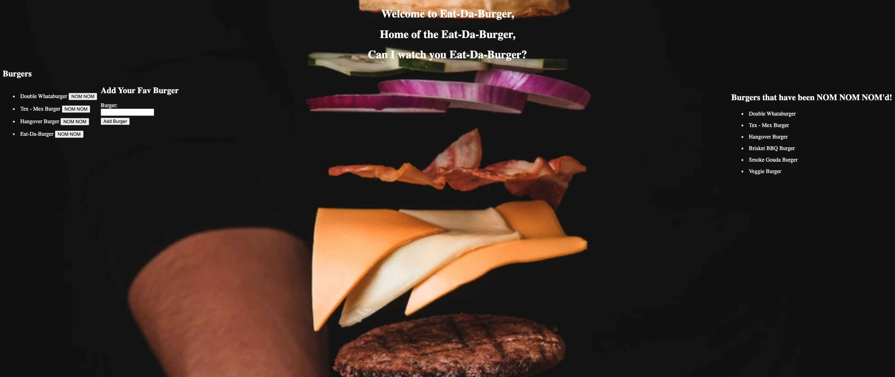
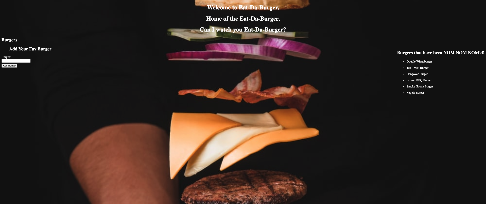

<h1 align="center">Eat-Da-Burger</h1>

## Description
  This application is using NodeJS, ExpressJS and Express-Handlebars, mySQL, and also Heroku as a deployment platform with a little help from the JawsDB by Amazon to make use of a remote database.

## Table Of Contents
- [Description](#discriptionOfProject)
- [Installation](#installationOfProject)
- [Usage](#usageOfProject)
- [License](#licenseOfProject)
- [Test](#testOfProject)
- [Issues](#issuesOfProject)
- [Contributors](#contributorsOfProject)

## Installation
  We are taking advantage of a few things installed with this application,express, mySql,express-handlebars.

## Usage
  This application's usage is super simple, as the front end is hosted online and requires no setup of any kind by any user who wishes to engage in some digital burger consumption. [Eat-Da-Burger](https://guarded-meadow-35936.herokuapp.com/)

## License
  Open

  This application is covered by the Open license.

## Test
  na

## Issues
  Simply click the "Eat it!!" buttons to consume a burger on the left hand side of the page, after which it is officially devoured and cannot be interacted with but will visible on the right hand side. You can also add as many new burgers as you want by filling out the text field at the bottom and clicking "Add Burger".

## Contributors
  Just myself, Michael Griffith

## Github
  GriffMike167

## Email
  griffithcmichael@gmail.com

